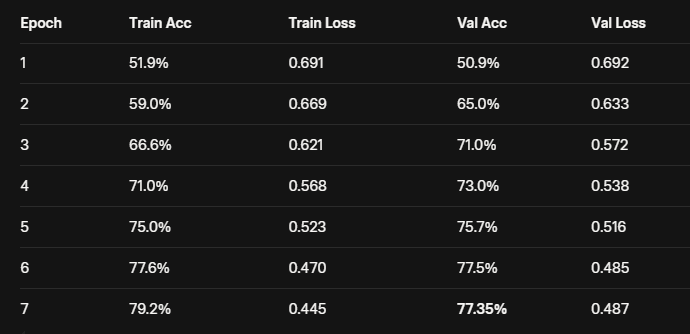

# Dogs vs Cats Image Classification using CNN

Dự án đơn giản nhận diện ảnh chó và mèo bằng Convolutional Neural Network (CNN) với TensorFlow/Keras.

**Dataset**: [Dogs vs Cats Images](https://www.kaggle.com/datasets/chetankv/dogs-cats-images) (25,000 ảnh, ~780MB)  
→ Cấu trúc thư mục chuẩn như Kaggle cung cấp:
```
Data/dataset/
├── training_set/
│   ├── cats/
│   └── dogs/
└── test_set/
├── cats/
└── dogs/
```

### Kiến trúc mô hình 
```
Input (64×64×3)
→ Conv2D(16, 3×3) + ReLU → MaxPool  
→ Conv2D(32, 3×3) + ReLU → MaxPool  
→ Conv2D(64, 3×3) + ReLU → MaxPool  
→ Flatten → Dense(128) + ReLU → Dropout(0.5)  
→ Dense(1) + Sigmoid

Optimizer: Adam
Loss: binary_crossentropy
Batch size: 8
Epochs: 7 (dừng sớm để tránh mất thời gian)
```

### Kết quả huấn luyện (7 epochs)



### Kiểm tra 10 ảnh ngẫu nhiên

Số ảnh dự đoán đúng: `7/10`
Độ chính xác thực tế: `70%`
Các trường hợp sai chủ yếu là ảnh mờ, góc chụp lạ, hoặc chó/mèo trông giống nhau.
